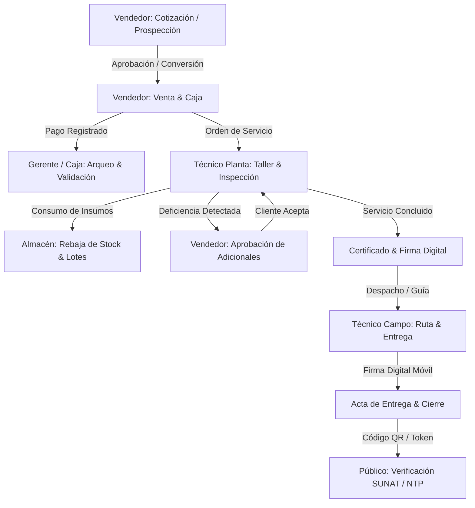

# PROYECTO: Bruce Fire S.A.C. — ERP & Sistema de Gestión Comercial y Operativa

## 1. Visión del Sistema

Bruce Fire S.A.C. es una solución ERP integral, multi-sede y multi-rol para la venta de equipos, recarga/mantenimiento de extintores, inspección técnica ITSE, emisión de certificados de operatividad y facturación electrónica UBL 2.1 con SUNAT (Greenter).

El sistema está concebido para uso 100% empresarial, sin registro público (alta únicamente por invitación/administración). Conecta cinco roles operativos en una cadena de custodia ininterrumpida y ofrece validación pública de certificados vía código QR para inspectores de Defensa Civil e ITSE.

---

## 2. Stack Tecnológico

### Backend

- **Framework:** Laravel 13.x en PHP 8.3
- **Autenticación:** Laravel Fortify (soporte para credenciales, 2FA, passkeys)
- **Roles & Permisos:** Spatie Laravel Permission (Vendedor, Gerente, Almacén, Técnico de Planta, Técnico de Campo)
- **Facturación Electrónica:** Greenter Lite v4.3 (UBL 2.1, Facturas, Boletas, Notas de Crédito/Débito, Guías de Remisión, CDR SUNAT)
- **Documentos & Códigos:** Barryvdh DomPDF v3.1, PhpWord v1.1, Endroid QR Code v5, Picqer Barcode Generator v3.3
- **Rutas Tipadas:** Laravel Wayfinder
- **Pruebas y Calidad:** Pest PHP v4.7, PHPStan (Larastan v3.9), Laravel Pint

### Frontend

- **Framework:** React 19.x con TypeScript 5.7+
- **Integración SPA:** Inertia.js v3.0 (@inertiajs/react, @inertiajs/vite)
- **Estilos:** Tailwind CSS v4, animaciones con tw-animate-css
- **UI Primitives:** Radix UI (Dialog, Dropdown, Select, Tooltip, Avatar, Toggle, etc.)
- **Notificaciones:** Sonner v2.0
- **Iconografía:** Lucide React
- **Compilador & Bundler:** Vite 8 con Vite Plus (`vp`) y React Compiler

---

## 3. Arquitectura Multi-Rol y Cadena de Valor (5 Roles + Público)

1. **Vendedor:** Cotizaciones, CRM clientes/sedes, apertura de ventas, caja chica/turnos, emisión de comprobantes, gestión de deficiencias detectadas.
2. **Gerente:** Panel directivo, arqueos consolidados, auditoría de logs, análisis de retención ML, configuración fiscal y de empresa, transferencias entre sedes.
3. **Almacén:** Control de inventario físico (PQS, CO2, repuestos, equipos nuevos), control de lotes y vencimientos, transferencias, kardex y guías de remisión.
4. **Técnico de Planta (Taller):** Recepción de extintores, checklists técnicos (NTP 350.043), pruebas hidrostáticas, registro de deficiencias, consumo de insumos.
5. **Técnico de Campo (Logística & Rutas):** Rutas de entrega, inspecciones in situ, acta de entrega con firma táctil digital, sincronización móvil.
6. **Público / Inspectores ITSE:** Verificación de autenticidad de certificados mediante enlace tokenizado o código QR en el collarín del extintor.

---

---

## 5. Historial y Contexto Centralizado desde Obsidian

A través de la integración con la bóveda de Obsidian (`Bruce Fire/` y `Documentación de Bruce Fire SAC/`), se consolidan las siguientes decisiones previas y estado de deuda técnica:

### Decisiones Arquitectónicas Previas (Confirmadas)

- **Zona Horaria:** Configurada a `America/Lima` (previamente UTC provocaba desfases de cálculo en ventas de fin de mes y cortes nocturnos de caja).
- **Control de Acceso Multi-Sede:** `EnsureTieneSede` y métodos en `User` (`sedeRestringidaId`, `vendedorRestringidoId`, `almacenRestringidoId`).
- **Seguridad en Producción:** `DatabaseSeeder` ya no genera contraseñas por defecto "password"; el primer Gerente se crea por CLI (`sistema:crear-gerente`).
- **Salud del Sistema:** Servicio de verificación automática `App\Services\SaludDelSistema` con 13 comprobaciones de integridad (stock negativo, comprobantes huérfanos, descuadres).

### Deuda de UI y Experiencia Identificada en Obsidian (Pendiente de Ejecución)

1. **Disparidad de Pestañas:** Coexisten 4 estilos diferentes (subrayado, segmentado gris, píldoras rojas y píldoras con íconos). Se unificará bajo el estándar de **Segmented Control estilo Apple**.
2. **Componentes no Estandarizados:** Falta de un componente maestro reutilizable para tarjetas KPI (`KpiCard`) y tablas responsivas con soporte de tarjeta móvil.
3. **Mascota Chispa en Móvil:** El widget flotante obstaculiza botones de acción en viewports móviles (≤ 375px); debe reubicarse u ocultarse tras un disparador no invasivo.
4. **Datos Pendientes en Inertia:** Compartir el objeto `currentSede` enriquecido (nombre, tipo, almacén asociado) globalmente desde `HandleInertiaRequests`.
5. **Tipografía y Tokens:** Unificar 490 instancias de `text-[..px]` y 324 radios `rounded-[..px]` hacia tokens semánticos de Tailwind v4 y SF Pro.
